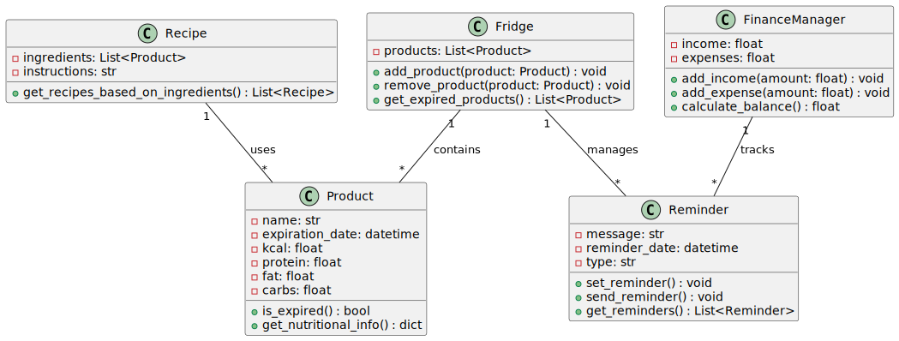

# Всё под контролем

## Сердечный Глеб Николаевич
## Б05-252

## Описание проекта
Проект "Всё под контролем" — это приложение, разработанное на языке Python, которое помогает пользователям управлять продуктами в холодильнике, отслеживать калорийность и нутриенты, напоминать о покупках, а также контролировать финансы и расходы. Приложение позволяет пользователю вести учет всех продуктов, планировать покупки и составлять бюджеты, а также напоминать о домашних делах, таких как стирка белья, уборка и вынос мусора.

## Реализуемый функционал
Приложение будет обладать следующими основными функциями:

1. **Учет продуктов в холодильнике**:
   - Добавление, редактирование и удаление продуктов.
   - Отображение информации о сроках годности.

2. **КБЖУ (Калории, Белки, Жиры, Углеводы)**:
   - Расчет КБЖУ для каждого продукта.
   - Подсчет общего КБЖУ в холодильнике.

3. **Напоминания**:
   - Настройка напоминаний о покупке продуктов (например, масла, губок и т.д.).
   - Уведомления о том, когда срок годности продукта истекает.
   - Обычные напоминания о домашних делах, таких как стирка, уборка и вынос мусора.

4. **Управление финансами**:
   - Ведение учета доходов и расходов.
   - Разделение чека и долгов между пользователями.

5. **Рецепты и рекомендации**:
   - Предложение рецептов на основе доступных продуктов.
   - Рекомендации по оптимизации расходов.

## Технологии и библиотеки
Для реализации веб-сервера будут использованы следующие технологии и библиотеки:

- **Python.10**: основной язык программирования.
- **FastAPI**: современный веб-фреймворк для создания API.
- **MongoDB**: документно-ориентированная база данных для хранения информации о продуктах и пользователях.
- **Pydantic**: библиотека для валидации данных и работы с моделями.
- **Motor**: асинхронный драйвер для работы с MongoDB.
- **Jinja2**: шаблонизатор для генерации HTML-страниц (Не уверен, что использую).
- **Bootstrap**: CSS-фреймворк для быстрого создания адаптивных веб-интерфейсов (Не уверни, что использую).
- **Celery**: библиотека для выполнения фоновых задач (Попробую для, отправка напоминаний).
- **APScheduler**: библиотека для планирования задач, таких как отправка напоминаний (Тоже попробуем).

## Архитектура
Проект будет организован по архитектуре MVC (Model-View-Controller):

- **Model**:
  - Содержит классы и функции для работы с базой данных MongoDB (например, классы `Product`, `FinanceManager`, `Reminder`).

- **View**:
  - HTML-страницы, генерируемые с помощью Jinja2 и Bootstrap (опционально, если используется интерфейс).

- **Controller**:
  - FastAPI-роуты, которые обрабатывают запросы пользователей, взаимодействуют с моделями и возвращают соответствующие представления.

## Алгоритмы
Приложение будет использовать следующие алгоритмы для выполнения ключевых функций:

1. **Учет продуктов**:
   - При добавлении продукта проверяется, существует ли он уже в базе данных, и обновляются соответствующие данные.

2. **Расчет КБЖУ**:
   - При добавлении нового продукта осуществляется расчет его КБЖУ, который хранится в базе данных и обновляется при изменении данных продукта.

3. **Напоминания**:
   - Напоминания будут создаваться пользователями и храниться в базе данных. Фоновый процесс (с помощью Celery и APScheduler) будет проверять и отправлять уведомления в установленное время.

4. **Управление финансами**:
   - Пользователь может добавлять доходы и расходы, и приложение будет автоматически рассчитывать баланс на основе введенных данных.

5. **Рекомендации по рецептам**:
   - Используя алгоритмы для анализа имеющихся продуктов, приложение будет предлагать пользователю подходящие рецепты.

### Классы:

1. **Product**
   - **Атрибуты**:
     - `name`: название продукта
     - `expiration_date`: дата истечения срока годности
     - `kcal`: калорийность
     - `protein`: белки
     - `fat`: жиры
     - `carbs`: углеводы
   - **Методы**:
     - `is_expired()`: проверяет, истек ли срок годности продукта
     - `get_nutritional_info()`: возвращает информацию о КБЖУ

2. **Fridge**
   - **Атрибуты**:
     - `products`: список продуктов в холодильнике
   - **Методы**:
     - `add_product(product)`: добавляет продукт в холодильник
     - `remove_product(product)`: удаляет продукт из холодильника
     - `get_expired_products()`: возвращает список просроченных продуктов

3. **Reminder**
   - **Атрибуты**:
     - `message`: текст напоминания
     - `reminder_date`: дата напоминания
     - `type`: тип напоминания (покупка, домашняя задача и т.д.)
   - **Методы**:
     - `set_reminder()`: устанавливает новое напоминание
     - `send_reminder()`: отправляет уведомление
     - `get_reminders()`: возвращает список всех напоминаний

4. **FinanceManager**
   - **Атрибуты**:
     - `income`: общий доход
     - `expenses`: общий расход
   - **Методы**:
     - `add_income(amount)`: добавляет доход
     - `add_expense(amount)`: добавляет расход
     - `calculate_balance()`: рассчитывает баланс

5. **Recipe**
   - **Атрибуты**:
     - `ingredients`: список ингредиентов
     - `instructions`: пошаговая инструкция
   - **Методы**:
     - `get_recipes_based_on_ingredients()`: возвращает рецепты на основе имеющихся продуктов

## Установка и запуск
Из backend docker-compose up

Далее из app fastapi dev main.py

## Возможные добавления функционала
- Управление умными устройствами (чтобы например не забывать проветривать комнату)
- Разделение обязанностей между людьми
- График планов и календарь

## Uml диаграмма
